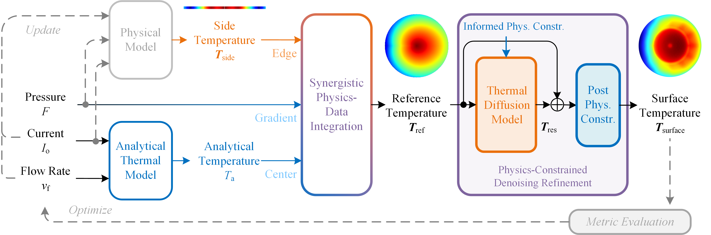

# DiGCT: Synergistic Physics-Data Constrained Diffusion Model for Surface Thermal Management of Press-Pack IGCTs


 [](https://github.com/fleaxiao/DiGCT)
[](https://huggingface.co/datasets/fleaxiao/IGCTX)

Official implementation for "Synergistic Physics-Data Constrained Diffusion Model for Surface Thermal Management of Press-Pack IGCTs". This project enables a diffusion-based digital twin model to monitor, evaluate, and optimize the surface temperature distribution of press-Pack IGCTs.



## ✨ Highlights
* **Synergistic Physics-Data Integration**: The GCT surface temperature reference is constructed by interpolating analytical predictions and real-time temperature measurements. This synergistic integration compresses the physical mechanisms and empirical observations into a geometric representation.
* **Physics-Constrained Denoising Refinement**: The proposed diffusion model iteratively refines the residual error of the reference, generating high-fidelity GCT surface temperature distribution following physical consistency.
* **Gradient-Based Temperature Optimization**: n online optimization strategy is developed to regulate GCT surface temperature distributions, supporting diverse metrics such as maximum value, mean value, and spatial variance.
* **Specialized Dataset _`IGCT X`_**: The first open-source dataset tailored for surface thermal management of press-pack IGCTs is introduced. It contains GCT surface and side temperature data in pairs, considering multiple physics coupling effects and varied system parameters.

## 🧩 Setup Guideline
Please meet the package requirement of `assets/requirement.yaml`. 
```bash
conda env create -n DiGCT -f requirement.yml
```
In general, the following dependencies should be installed
* Python >= 3.12
* PyTorch >= 1.6.0

## 🔥 Quickstart

### 🗂️ Data Preparation
* Create an empty folder `data`
```bash
mkdir -n data
```
* Download the open-source dataset [IGCTX](https://huggingface.co/datasets/fleaxiao/IGCTX) in the folder `data`
* Adjust the key parameters for temperature preprocess and analytical model in `configs/config_data.yml`

    - surface: clip the surface temperature target
    - side: clip side temperature measurement
    - L2S: convert the side temperature measurement line to the surface view reference
    - P2S: convert the side temperature measurement points to the surface view reference
    - PA2S: convert the side temperature measurement points and the analytical model result to the surface view reference
    - G: calculate the gap between surface temperature target and the temperature reference

* Preprocess data for DiGCT training. The preprocessed dataset should appear in the folder `dataset`
```bash
python data.py -config configs/config_data.yml
```

### 💪 Model Training
* Adjust the key parameters for model training in `configs/config_model.yml`

    - training: on-off switch for training
    - generate_sample: on-off switch for sample generation after training
    - physics_constraint: on-off switch for physics-constrained denoising refinement

* Train model. The training results should appear in the folder `results`
```bash
python model.py -config configs/config_model.yml
```

### ✍️ Model Testing
* Adjust the key parameters for model testing in `configs/config_model.yml`

    - testing: on-off switch for testing
    - test_path: path of result folder
    - calculate_metric: evaluate the model performance based on the generated samples
    - sample_metric: evaluate the model performance through sampling process

* Test model. The training results should appear in the corresponding testing folder
```bash
python model.py -config configs/config_model.yml
```

## 🙏 Acknowledgement

The project is built based on the following repository:
- [lucidrains/denoising-diffusion-pytorch](https://github.com/lucidrains/denoising-diffusion-pytorch)
- [ximinng/LLM4SVG](https://github.com/ximinng/LLM4SVG)

We gratefully thank the authors for their wonderful works.

## 📋 Citation
If you use this code for your research, please cite the following work:

```

```

## ☎️ Contact
If you have any questions, please contact the authors at x.yang2@tue.nl

## ©️ License
This work is licensed under the MIT License.