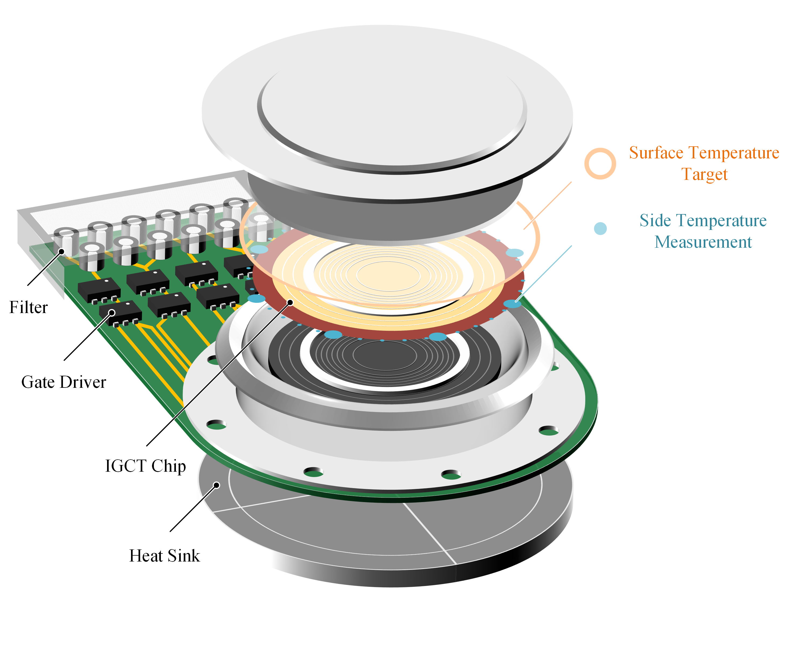

# DiGCT: Reference-Refined Diffusion Model for Online Thermal Management of Press-Pack IGCTs


 [](https://github.com/fleaxiao/DiGCT)
[](https://huggingface.co/datasets/fleaxiao/IGCTX)

Official implementation for "Reference-Refined Diffusion Model for Online Thermal Management of Press-Pack IGCTs via Synergistic Physics-Data Integration". This project enables a diffusion-based digital twin model to estimate, evaluate, and adjust the surface temperature of press-Pack IGCTs.



## ✨ Highlights
* **Synergistic Physics-Data Integration**: Integrates the analytical model and measurement data to an unified IGCT surface temperature representative.
* **Reference-Refined Diffusion Model (R2DM)**: Iteratively refines the residual difference between the reference and the target to achieve high modeling performance.
* **Closed-loop Surface Temperature Optimization**: Supports multiple evaluation criteria to adjust the IGCT surface temperature distribution.
* **Specialized `IGCT X` Dataset**: introduces the first open-source dataset dedicated the surface temperature of IGCTs, considering pressure eccentricity, thermal expansion and variation of system metrics (current, pressure, heat dissipation).

## 🧩 Setup Guideline
Please meet the package requirement of `environment.yaml`. 
```bash
conda env create -n DiGCT -f requirement.yml
```
In general, the following dependencies should be installed
* Python >= 3.12
* PyTorch >= 1.6.0

## 🔥 Quickstart

### 🗂️ Data Preparation
* Create an empty folder `data`
```bash
mkdir -n data
```
* Download the open-source dataset [IGCT X](https://huggingface.co/datasets/fleaxiao/IGCTX) in the folder `data`
* Adjust the key parameters for image and analytical model in `configs/config_data.yml`

    - surface: clip the surface temperature target
    - side: clip side temperature measurement
    - L2S: convert the side temperature measurement line to the surface view reference
    - P2S: convert the side temperature measurement points to the surface view reference
    - PA2S: convert the side temperature measurement points and the analytical model result to the surface view reference
    - G: calculate the gap between surface temperature target and the surface view reference

* Preprocess data for DiGCT training. The preprocessed dataset should appear in the folder `dataset`
```bash
python data.py -config configs/config_data.yml
```

### 💪 Model Training
* Adjust the key parameters for model training in `configs/config_model.yml`

    - training: on-off switch for training
    - reference_refined: on-off switch for reference refining

* Train model. The training results should appear in the folder `results`
```bash
python model.py -config configs/config_model.yml
```

### ✍️ Model Testing
* Adjust the key parameters for model testing in `configs/config_model.yml`

    - testing: on-off switch for testing
    - test_path: path of result folder
    - calculate_metric: evaluate the model performance based on the generated samples
    - sample_metric: evaluate the model performance through sampling process

* Test model. The training results should appear in the corresponding testing folder
```bash
python model.py -config configs/config_model.yml
```

## 📑 Acknowledgement

The project is built based on the following repository:
- [lucidrains/denoising-diffusion-pytorch](https://github.com/lucidrains/denoising-diffusion-pytorch)
- [ximinng/PyTorch-SVGRender](https://github.com/ximinng/PyTorch-SVGRender)

We gratefully thank the authors for their wonderful works.

## 📋 Citation
If you use this code for your research, please cite the following work:

```
@InProceedings{svgdreamer_xing_2023,
    author    = {Xing, Ximing and Zhou, Haitao and Wang, Chuang and Zhang, Jing and Xu, Dong and Yu, Qian},
    title     = {SVGDreamer: Text Guided SVG Generation with Diffusion Model},
    booktitle = {Proceedings of the IEEE/CVF Conference on Computer Vision and Pattern Recognition (CVPR)},
    month     = {June},
    year      = {2024},
    pages     = {4546-4555}
}
```

## ☎️ Contact
If you have any questions, please contact the authors at x.yang2@tue.nl

## ©️ License
This work is licensed under a MIT License.