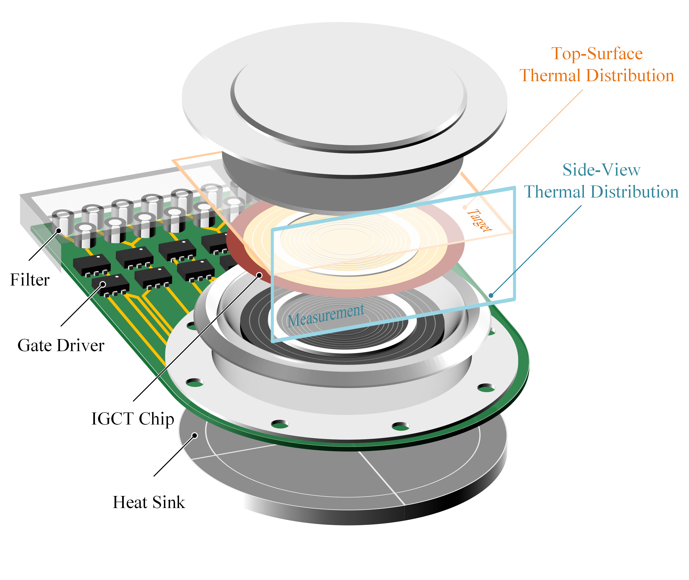

# DiGCT: Online Thermal Monitoring fo IGCT via Physics-Informed Diffusion Model

 

Official implementation for "Physics-Informed Diffusion Model for Press-Pack IGCT Online Thermal Monitoring Based on Recurrent Polar Convolutional Neural Network"



## 🧩 Setup Guideline
Please meet the requirement of `environment.yaml`. In general, the following dependencies should be installed
* PyTorch >= 1.6.0
* numpy
* Python >= 3.6 

## 🔥 Quickstart

### 🗂️ Data Format
### 💪 Model Training
### ✍️ Model Inference

## 📑 Acknowledgement

The project is built based on the following repository:
- [lucidrains/denoising-diffusion-pytorch](https://github.com/lucidrains/denoising-diffusion-pytorch)
- [ximinng/PyTorch-SVGRender](https://github.com/ximinng/PyTorch-SVGRender)

We gratefully thank the authors for their wonderful works.

## 📋 Citation
If you use this code for your research, please cite the following work:

```
@InProceedings{svgdreamer_xing_2023,
    author    = {Xing, Ximing and Zhou, Haitao and Wang, Chuang and Zhang, Jing and Xu, Dong and Yu, Qian},
    title     = {SVGDreamer: Text Guided SVG Generation with Diffusion Model},
    booktitle = {Proceedings of the IEEE/CVF Conference on Computer Vision and Pattern Recognition (CVPR)},
    month     = {June},
    year      = {2024},
    pages     = {4546-4555}
}
```

## ©️ License
This work is licensed under a MIT License.