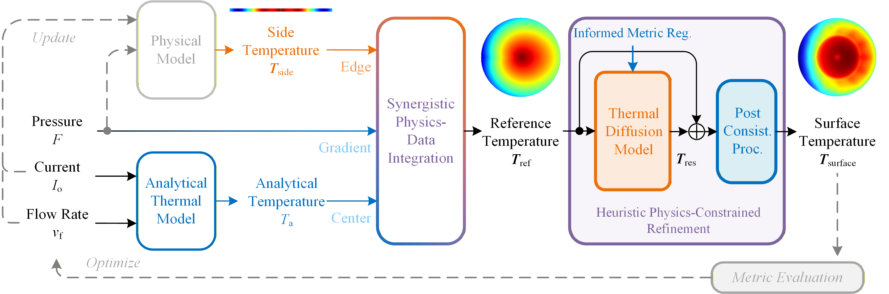

# DiGCT: Synergistic Physics-Data Constrained Diffusion Model for Surface Thermal Management of Press-Pack IGCTs

Official implementation for "Synergistic Physics-Data Constrained Diffusion Model for Surface Thermal Management of Press-Pack IGCTs". This project enables a diffusion-based digital twin model to monitor, evaluate, and optimize the surface temperature distribution of press-pack IGCTs.



## ✨ Highlights
* **Synergistic Physics-Data Integration**: The GCT surface temperature reference is constructed by interpolating analytical predictions and real-time temperature measurements. This synergistic integration compresses the physical mechanisms and empirical observations into a geometric representation.
* **Heuristic Physics-Constrained Refinement**: The proposed diffusion model iteratively refines the residual error of the reference, generating high-fidelity GCT surface temperature distribution following specific regulation and consistency requirements.
* **Gradient-Based Temperature Optimization**: An online optimization strategy is developed to regulate GCT surface temperature distributions, supporting diverse metrics such as maximum value, mean value, and spatial variance.
* **Specialized Dataset _`IGCT X`_**: The first dataset tailored for surface thermal management of press-pack IGCTs is introduced. It contains GCT surface and side temperature data in pairs, considering multiple physics coupling effects and varied system parameters.

## 🧩 Setup Guideline
Please meet the package requirement of `assets/requirement.yaml`. 
```bash
conda env create -n DiGCT -f requirement.yml
```
In general, the following dependencies should be installed
* Python >= 3.12
* PyTorch >= 1.6.0

## 🔥 Quickstart

### 💪 Model Training
* Adjust the key parameters for model training in `configs/config_model.yml`

    - training: on-off switch for training
    - generate_sample: on-off switch for sample generation after training
    - physics_constraint: on-off switch for physics-constrained denoising refinement

* Train model. The training results should appear in the folder `results`
```bash
python model.py -config configs/config_model.yml
```

### ✍️ Model Testing
* Adjust the key parameters for model testing in `configs/config_model.yml`

    - testing: on-off switch for testing
    - test_path: path of result folder
    - calculate_metric: evaluate the model performance based on the generated samples
    - sample_metric: evaluate the model performance through sampling process

* Test model. The training results should appear in the corresponding testing folder
```bash
python model.py -config configs/config_model.yml
```

## 🙏 Acknowledgement

The project is built based on the following repository:
- [hojonathanho/diffusion](https://github.com/hojonathanho/diffusion)
- [ximinng/LLM4SVG](https://github.com/ximinng/LLM4SVG)

We gratefully thank the authors for their wonderful works.

## 📋 Citation
If you use this code for your research, please cite the following work:

```
@ARTICLE{11567995,
  author={Yang, Xiao and Xiao, Yu and Li, Tianchen and Yang, Dongsheng},
  journal={IEEE Transactions on Industrial Informatics}, 
  title={Synergistic Physics-Data Constrained Diffusion Model for Surface Thermal Management of Press-Pack IGCTs}, 
  year={2026},
  pages={1-11},
  doi={10.1109/TII.2026.3693363}}
```

## ☎️ Contact
If you have any questions, please contact the authors at x.yang2@tue.nl

## ©️ License
This work is licensed under the MIT License.